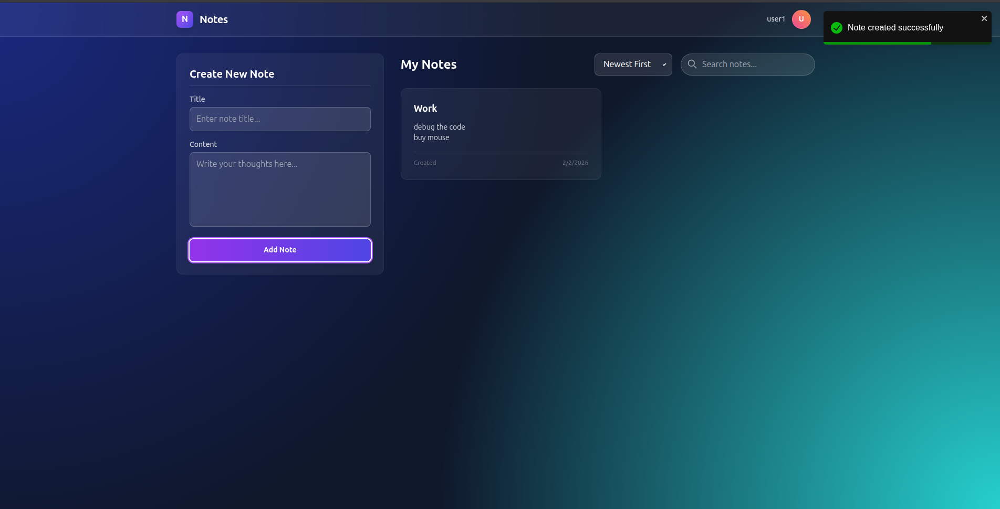

# Auth + Dashboard App

A simple full-stack web application with Authentication and a Dashboard for Notes CRUD operations.

<!-- 
    TODO: Add an image of the application dashboard here.
    Replace the path below with your actual image path, e.g., ./screenshots/dashboard.png 
-->


Built with MERN Stack (MongoDB, Express, React, Node.js).
UI Library: TailwindCSS.

## Tech Stack
- **Frontend**: React (Vite), TailwindCSS, Axios, React Router Dom
- **Backend**: Node.js, Express, Mongoose, JWT, Bcryptjs
- **Database**: MongoDB

## Features
- User Authentication (Signup, Login, Logout)
- Protected Dashboard Route
- User Profile Display
- Create, Read, Update, Delete (CRUD) Notes
- Token-based Authentication (JWT)
- Password Encryption (Bcrypt)

## Setup Instructions

Follow these steps to get the application running locally.

### Prerequisites
1.  **Node.js**: Ensure you have Node.js (v18 or higher) installed. [Download Node.js](https://nodejs.org/)
2.  **MongoDB**: You need a running MongoDB instance.
    -   **Local**: Install MongoDB Community Edition and ensure it's running (usually on port `27017`).
    -   **Cloud**: Or use MongoDB Atlas and get your connection string.

### 1. Clone the Repository
```bash
git clone <repository-url>
cd notes_app
```

### 2. Backend Setup (Server)
The backend runs on port `5000` by default.

1.  Navigate to the server directory:
    ```bash
    cd server
    ```

2.  Install dependencies:
    ```bash
    npm install
    ```

3.  **Environment Variables**:
    -   Create a `.env` file in the `server` directory.
    -   Copy the content from `.env.example`:
        ```bash
        cp .env.example .env
        ```
    -   Open `.env` and verify the configuration:
        ```env
        PORT=5000
        MONGO_URI=mongodb://localhost:27017/auth_app  # Change this if using Atlas
        JWT_SECRET=your_super_secret_key_change_this
        NODE_ENV=development
        ```

4.  Start the server:
    ```bash
    npm run dev
    ```
    You should see: `Server running in development mode on port 5000` and `MongoDB Connected`.

### 3. Frontend Setup (Client)
The frontend runs on port `5173` by default.

1.  Open a **new terminal** window/tab.
2.  Navigate to the client directory:
    ```bash
    cd client
    ```

3.  Install dependencies:
    ```bash
    npm install
    ```

4.  Start the development server:
    ```bash
    npm run dev
    ```
    Access the app at `http://localhost:5173`.

## Usage / Workflow
1.  Open `http://localhost:5173`.
2.  **Signup**: Create a new account.
3.  **Dashboard**: You will be redirected here after login.
    -   **Create Note**: Use the form on the left.
    -   **View Notes**: See your notes on the right.
    -   **Search/Filter**: Search by text or sort by Date (Newest/Oldest).
    -   **Edit/Delete**: Use the icons on each note card.
4.  **Logout**: Click the Logout button in the specific navbar.

<!-- 
    TODO: Add an image of the Note Creation process or Login screen here.
-->


## API Documentation
A Postman collection is included in the root directory: `postman_collection.json`. Import it into Postman to test APIs directly.

---

## Troubleshooting

### 1. "Failed to connect to MongoDB"
-   Make sure your MongoDB service is running.
-   If using MongoDB Atlas, check if your IP is whitelisted in Atlas settings.
-   Verify the `MONGO_URI` in `server/.env` is correct.

### 2. "Network Error" or API calls failing
-   Ensure the **Backend Server** is running on port 5000.
-   Check browser console (F12) for CORS errors. (The server is configured to accept requests from localhost:5173).

### 3. "Vite: Failed to resolve import"
-   If you see missing dependency errors, run `npm install` inside the `client` folder again.

### 4. Port Conflicts
-   If port 5000 or 5173 is busy, stop the other process or change the port in `.env` (server) and `vite.config.js` (client).

## 🚀 How to Scale for Production

To scale this application for production, I would implement the following strategies:

1. **Deployment & Environment**:
   - Containerize the app using **Docker** for consistent environments.
   - Use orchestration tools like **Kubernetes** or manage via **AWS ECS** for auto-scaling based on load.
   - Use strict CORS policies and secure Cookie attributes (HttpOnly, Secure) for token storage.

2. **Database Optimization**:
   - Add **Indexes** on frequently queried fields.
   - Implement **Caching** (Redis) for frequently accessed data.
   - Use a managed DB service (MongoDB Atlas) with auto-scaling.

3. **Performance & Reliability**:
   - Implement **Rate Limiting** to prevent abuse.
   - Use a **Load Balancer** (Nginx or AWS ALB) to distribute traffic.
   - meaningful **Logging** and Monitoring.
